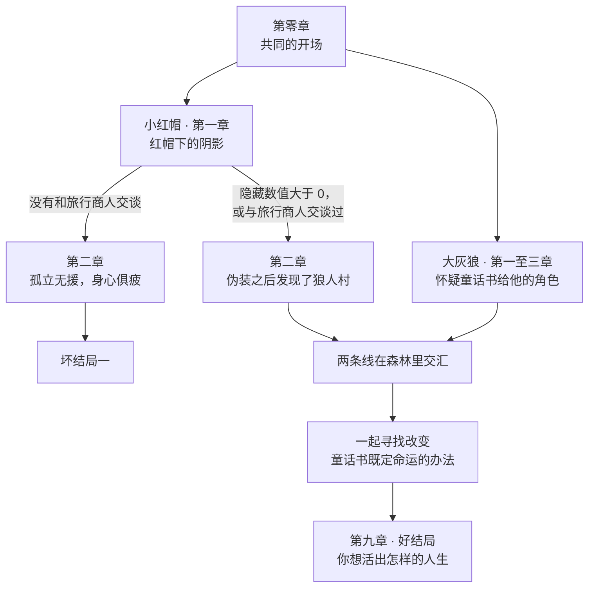

# 小红帽：后传

[English](README.md) | **中文**

一款用 Unreal Engine 5 制作的叙事向 RPG 游戏 Demo：2D 像素角色行走在使用像素贴图的 3D 场景里。这是我 2024 年的专科毕业设计（数字媒体技术专业，上海南湖数字创意系），一个人用大约三个月完成。

**[观看完整演示视频](media/little-red-sequel-demo.mp4)**（6 分 35 秒）· [下载 MP4](https://github.com/Zeeekrom/little-red-sequel/raw/main/media/little-red-sequel-demo.mp4)

本仓库只包含展示材料：演示视频、截图、制作过程图和展览海报。Unreal 工程文件和毕业论文不在其中。

## 目录

- [概览](#概览)
- [游戏简介](#游戏简介)
- [剧情设计](#剧情设计)
- [玩法设计](#玩法设计)
- [场景](#场景)
- [从概念图到成品场景](#从概念图到成品场景)
- [资产制作](#资产制作)
- [材质与特效](#材质与特效)
- [程序](#程序)
- [设计之前的调研](#设计之前的调研)
- [项目管理](#项目管理)
- [未完成的部分](#未完成的部分)
- [收获](#收获)
- [工具](#工具)

## 概览

| | |
|---|---|
| 类型 | 叙事向 RPG，包含探索、任务和分支对话 |
| 基调 | 黑暗童话，先抑后扬 |
| 主题 | 拒绝被别人写好的人生、独立思考、反霸凌、反信息茧房 |
| 引擎 | Unreal Engine 5.3 |
| 团队 | 个人独立开发，约三个月：两个月筹备，一个月整合 |
| 体量 | 约 199 套美术资产（3D 124 套，2D 75 套），三套玩法系统，调研了 20 款参考游戏 |
| 状态 | 可游玩的 Demo，已实现部分剧情 |

## 游戏简介

在这个世界里，每个人出生时都带着一本童话书。大多数人的书是空白的；少数人是"主角"，他们的书里早已写好了一生，要做的就是照着演完，好让自己的故事被抄进每个人的童话书里，用来教育后人。这个世界本身是由人工智能创造的，而生活在其中的人并不知道。

你扮演新一代的小红帽。村子给她定了规矩：沿着大路走，永远穿红色，遵循童话书里的预言，也就是被大灰狼吃掉。游戏讲的是她不再照着书走之后发生的事。

| | |
|---|---|
|  |  |
| 游戏开头，村子给小红帽定下的规矩 | 加载界面上的剧情文字 |

## 剧情设计

- **熟悉的故事，被质疑的角色。** 童话书里的主角永远正义勇敢，现实却未必：有的"主角"本质是恶人，却因为童话书被无条件地当作好人；有的"反派"并不是自己选择作恶。小红帽是少数拒绝照着剧本走的人之一。
- **双视角。** 第零章结束后，玩家可以继续扮演小红帽，也可以切换到大灰狼的视角，他开始怀疑童话书里描写的那个自己。两条故事线会交叠，并走向同一个目标，同样的事件可以从两边各看一遍。
- **分支取决于玩家做过什么。** 章节按条件解锁。比如前期，小红帽在被村长施压之前有没有和旅行商人交谈、隐藏数值是否大于零，决定了她走向一个坏结局，还是继续前往狼人村的那条线。
- **先画图，再写文本。** 我先把整个故事画成流程图，包含两条角色线、各章节名称、解锁条件和每章摘要，再据此编写对话和任务。
- **多套方案里选一套。** 定稿之前，我写了多套完整的故事方案，每套都包含概述、主线、主题和参考。

简化后的叙事结构：

## 玩法设计

- **箱庭探索。** 游戏由几个小而密的区域组成，比如村庄和室内。玩家通过走动、查看物品、与村民交谈来获取信息。
- **隐藏数值。** 探索和对话会悄悄提升"勇气"这类隐藏数值，数值超过阈值后会开启不同的故事线或结局。
- **含蓄的引导。** 游戏前期不直接指向真相，而是让玩家自己发现村民所说的和眼前所见之间的落差。部分段落会打破第四面墙，直接与玩家对话。
- **任务与交互。** 任务追踪界面显示当前目标、路标和距离。同一个"走近后按 F"的交互可以触发对话、推进任务、切换场景或修改隐藏数值。

| | | |
|---|---|---|
|  |  |  |
| 打开宝箱提升隐藏数值 | 带路标和距离的任务追踪 | 带玩家选项的对话 |

## 场景

| | | |
|---|---|---|
|  |  |  |
|  |  |  |
|  |  |  |

| | |
|---|---|
|  |  |
| 村庄外景，左上是任务追踪，场景中有路标 | 村庄舞台，带交互提示 |
|  |  |
| 在家中完成第一个任务 | 与小红帽母亲的对话 |
|  |  |
| 前往告示牌途中的小桥与河流 | 室内场景中的物品对话 |

## 从概念图到成品场景

| | |
|---|---|
|  |  |
| 1. 俯视概念图，标出主要资产的位置 | 2. 同一座岛的白盒和打光后的场景 |
|  |  |
| 3. 村庄：概念图、白盒和最终布局 | 4. 在玩家镜头角度下绘制地形图层 |

1. **概念图。** 用 Inkarnate 画俯视地图，确定主要建筑和地标的位置。
2. **白盒。** 在 Unreal 里摆放大型结构（房屋、塔楼、桥），其余中小型资产先用方块代替。
3. **地形。** 用一个带摄像机的蓝图固定玩家的俯视角度，在这个视角下按概念图刷地形高度，再用图层混合材质刷出岩石、泥土、草地和石子路。
4. **材质。** 用 xNormal 从颜色贴图生成法线贴图。在 Unreal 里给每个资产建材质实例，可以调法线强度、UV、金属度、粗糙度和高光。
5. **打光。** 加入灯光、特效、后处理体积、指数高度雾和天光，对照打光后的画面调整材质实例，最后烘焙光照。每个室内场景都走一遍同样的流程。

## 资产制作

| | |
|---|---|
|  |  |
| 资产清单的一部分：名称、所属场景、进度、截图和白盒说明 | 在 Blender 里检查做好的桥和贴图 |
|  |  |
| 生成像素贴图时用的采样和放大参数 | 作为 WebUI 替代方案测试过的 ComfyUI 工作流 |

部分完成的美术资产。

- **风格。** 2D 像素角色加上使用像素贴图的 3D 场景，观感接近 HD-2D 游戏。我调研了几款把两者结合起来的独立游戏之后选定了这个风格，因为对单人开发来说，它在制作效率和质量之间比较平衡。
- **体量。** 约 199 套美术资产，其中 3D 约 124 套，2D 约 75 套，另有特效、后处理和角色动画。我有意多做了一些，这样某一批资产不合格时不会拖住进度。
- **资产清单。** 用一张表跟踪所有资产：中英文名称、优先级、进度、所属场景、截图、白盒设计和参考图。
- **贴图流程。** 在 Maya 里做白模，用 RizomUV 展 UV，再用 Stable Diffusion 生成像素风贴图（融合两个像素风 LoRA，搭配像素风 SDXL 底模，图生图），然后在 Photoshop 里按 UV 修图。按这套流程，每天能完成十个左右的资产。
- **检查。** 每个资产都放到 Blender 的 Cycles 渲染器里预览，合格后按规范命名，截图登记到表里。
- **这套流程的边界。** 像素美术不容易看出接缝。我没有找到让生成贴图稳定无缝衔接的办法，所以这套方法只适用于像素风格。
- **手绘 2D。** 道具、角色和动画在 Aseprite 里绘制，其中角色像素图是对照参考图画的。
- **音频。** 音乐和音效不是我制作的，大部分是 CC0 资源。

## 材质与特效

| | |
|---|---|
|  |  |
| 随风摆动的植被和雾的材质节点 | 地形图层混合材质 |

Niagara 特效：萤火虫、烟雾和火焰。

- **特殊材质。** 随风摆动的植被；遮挡处理，让镜头和角色之间的物体不会挡住角色；UV 控制、菲涅尔，以及按深度和镜头距离做的渐变。
- **光照与氛围。** 自发光的灯和火、体积光、高度雾和后处理体积，底层是烘焙光照。
- **特效。** 火焰、萤火虫和烟雾用 Niagara 制作。启动 Logo 和粒子动画用 After Effects 和 Houdini 制作。

## 程序

大部分玩法逻辑用蓝图实现，任务系统和对话系统是暴露给蓝图使用的 C++ 类。

| | |
|---|---|
|  |  |
| 交互：进入范围后显示提示并开启输入，按键后开始对话 | 玩家蓝图：移动，以及位置和任务状态的保存与读取 |
|  |  |
| 2D 角色的动画蓝图（PaperZD）：按速度切换站立和行走 | 主菜单：继续游戏、新游戏、加载游戏、设置、退出 |
|  |  |
| 图形设置：分辨率、窗口模式、帧率、画质预设 | 存档与读档 |

游戏内菜单为中文，剧情文本为英文，详见[未完成的部分](#未完成的部分)。

- **任务系统。** C++ 类配合节点式任务编辑器，支持多种任务类型、完成条件判定和屏幕上的任务追踪。
- **对话系统。** C++ 类配合节点式分支对话编辑器，并与任务系统联动。
- **主菜单与存档。** 新游戏、继续游戏和读档。存档读写用蓝图类、蓝图接口、结构体和数据表实现，图形和声音设置调用 Unreal 的设置 API，界面用 UMG 制作。
- **玩家。** 控制器负责保存和恢复角色位置与任务状态，另有用于像素角色移动的动画蓝图。
- **交互。** 一个蓝图统一处理"走近后按键"的提示，用于对话、任务、切换场景和隐藏数值。
- **先单独测试。** 每套系统都先在一个小的测试工程里做出来、试过，再搬进游戏。
- **复用。** 菜单和存档系统相对独立，可以移植到其他项目里使用。

ChatGPT 参与了部分 C++ 头文件和蓝图逻辑的编写，也帮我打磨了故事文本，生成的内容都由我手动修正后再整合进项目。AI 工具对单人开发者能有多大帮助，本身就是这篇毕业论文要探讨的问题之一。

## 设计之前的调研

- **GameJam 作品。** 我分析了十款来自 Ludum Dare、itch.io、Reddit GameJam 和 Global Game Jam 的作品，每款都记录了制作背景、作品分析和可以借鉴的想法。叙事和 Meta 方面的点子，以及把交互做小做精的思路，都来自这里。
- **商业独立游戏。** 我更深入地分析了十款上过 Steam 独立游戏排行榜的作品。"2D 像素加 3D"的风格、非线性叙事、多结局和双视角，都先对照这些已经上线的游戏验证过。
- **游戏里的 AI。** 我整理了一张游戏制作中 AI 技术应用的表，并调研了一款商业游戏是怎么使用 AI 功能的。
- **技术预研。** 每种方法都先测试再采用：包括上面的贴图流程，以及在小 Demo 里验证过的菜单、任务和对话系统。

## 项目管理

- **排期。** 前两个月是筹备阶段，做调研、策划文档、技术预研和资产制作；最后一个月用于整合和完善。
- **文档。** 受众与玩法调研、故事方案、非线性叙事线、美术资产清单，以及游戏行业 AI 技术应用调研。
- **优先级。** 任务冲突时，策划文档优先于程序，程序优先于美术。
- **风险。** 筹备阶段没达到可用标准的资产在第二阶段重做，并提前多做一批备用资产。
- **跟踪。** 每周对照计划统计各项任务的耗时并做调整。
- **备份。** 工程每天用 GitHub 做版本管理，另在网盘和固态硬盘各留一份。
- **来自实习的经验。** 资产命名规范、资产跟踪表，以及先预研再投入的习惯，都来自我在游戏公司的实习。

## 未完成的部分

- 这是一个 Demo，只有部分剧情可以游玩，一些计划中的功能因为时间不够被删减了。
- 菜单为中文，剧情文本只有英文，语言切换功能没有做完。
- UI 美术比较基础，部分界面和音频是占位内容。
- 已知问题：读档时偶尔会卡在加载界面。

## 收获

- 这是我第一次把一款游戏从空白文档做到打包成品，也让我看清了制作各环节之间是怎么互相牵制的。
- 工业化流程缩小到一个人同样有用：需求分析、排期、版本管理和技术预研，对单人项目和对团队一样管用。
- AI 工具补上了我在策划和程序上的一部分短板，也加快了贴图制作，但生成的内容仍然需要自己检查和修改。
- 我有意减少了传统美术的比重，把时间更多放在技术美术和程序上。这也是我后来升本选择软件工程的原因。

## 工具

Unreal Engine 5.3、Visual Studio 2022、Maya 2024、Blender 4.1、RizomUV、Houdini 20、Substance 3D Painter 和 Designer、xNormal、Aseprite、Stable Diffusion WebUI、ComfyUI、Photoshop、After Effects、Inkarnate。

## 海报

这是为 2024 年毕业设计展制作的海报的英文版。原图上的联系方式已经去掉。

## 论文

本项目随毕业论文一同提交，论文题目是《数字媒体技术在游戏产业的创新应用：以独立游戏为例》（2024 年 5 月）。论文没有在这里公开。

## 版权与联系

© 2024 黄钰祥（Yuxiang Huang）。视频、截图和海报仅供作品集展示，如需使用请先联系我。

联系方式：[LinkedIn](https://www.linkedin.com/in/evan-h-165976301/)
