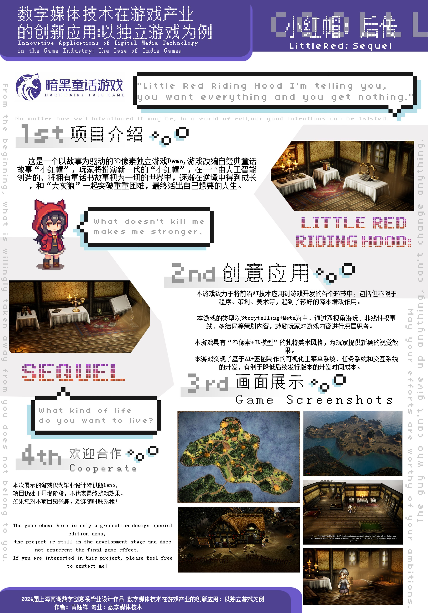

# 小红帽：后传

[English](README.md) | **中文**

一款用 Unreal Engine 5 制作的叙事向 RPG 游戏 Demo：2D 像素角色行走在使用像素贴图的 3D 场景里。这是我 2024 年的专科毕业设计（数字媒体技术专业，上海南湖数字创意系），一个人用大约三个月完成。

**[观看完整演示视频](media/little-red-sequel-demo.mp4)**（6 分 35 秒）· [下载 MP4](https://github.com/Zeeekrom/little-red-sequel/raw/main/media/little-red-sequel-demo.mp4)

本仓库只包含展示材料：演示视频、截图和展览海报。Unreal 工程文件和毕业论文不在其中。

## 游戏简介

在这个世界里，每个人出生时都带着一本童话书。大多数人的书是空白的；少数人是"主角"，他们的书里早已写好了一生，要做的就是照着演完，好让自己的故事被抄进每个人的童话书里，用来教育后人。这个世界本身是由人工智能创造的，而生活在其中的人并不知道。

你扮演新一代的小红帽。村子给她定了规矩：沿着大路走，永远穿红色，遵循童话书里的预言，也就是被大灰狼吃掉。游戏讲的是她不再照着书走之后发生的事。

| | |
|---|---|
| 类型 | 叙事向 RPG，包含探索、任务和分支对话 |
| 基调 | 黑暗童话，先抑后扬 |
| 主题 | 拒绝被别人写好的人生、独立思考、反霸凌、反信息茧房 |
| 引擎 | Unreal Engine 5.3 |
| 团队 | 个人独立开发，约三个月 |

## 游戏截图

| | |
|---|---|
|  |  |
| 村庄外景，左上是任务追踪，场景中有路标 | 村庄舞台，带交互提示 |
|  |  |
| 在家中完成第一个任务 | 与小红帽母亲的对话 |
|  |  |
| 前往告示牌途中的小桥与河流 | 室内场景中的物品对话 |
|  |  |
| 主菜单：继续游戏、新游戏、加载游戏、设置、退出 | 图形设置面板 |

游戏内菜单为中文，剧情文本为英文，详见[未完成的部分](#未完成的部分)。

## 剧情设计

- **熟悉的故事，被质疑的角色。** 童话书里的主角永远正义勇敢，现实却未必：有的"主角"本质是恶人，却因为童话书被无条件地当作好人；有的"反派"并不是自己选择作恶。小红帽是少数拒绝照着剧本走的人之一。
- **非线性结构。** 章节按条件解锁，故事有多个结局。我先把整个故事画成流程图，包含两条角色线、各章节名称、解锁条件和每章摘要，再据此编写对话和任务。
- **双视角。** 第零章结束后，玩家可以继续扮演小红帽，也可以切换到立场相反的第二位角色。两条故事线会交叠，并走向同一个目标，同样的事件可以从两边各看一遍。
- **过程。** 定稿之前，我写了多套完整的故事方案，每套都包含概述、主线、主题和参考。

## 玩法设计

- **箱庭探索。** 游戏由几个小而密的区域组成，比如村庄和室内。玩家通过走动、查看物品、与村民交谈来获取信息。
- **隐藏数值。** 探索和对话会悄悄提升隐藏数值，数值超过阈值后会开启不同的故事线或结局。玩家始终看不到具体数字。
- **含蓄的引导。** 游戏前期不直接指向真相，而是让玩家自己发现村民所说的和眼前所见之间的落差。部分段落会打破第四面墙，直接与玩家对话，加载界面上也有剧情文字。
- **任务与交互。** 任务追踪界面显示当前目标、路标和距离。同一个"走近后按 F"的交互可以触发对话、推进任务、切换场景或修改隐藏数值。

## 美术与技术美术

- **风格。** 2D 像素角色加上使用像素贴图的 3D 场景，观感接近 HD-2D 游戏。我调研了几款把两者结合起来的独立游戏之后选定了这个风格，因为对单人开发来说，它在制作效率和质量之间比较平衡。
- **体量。** 约 199 套美术资产，其中 3D 约 124 套，2D 约 75 套，另有特效、后处理和角色动画。
- **贴图流程。** 在 Maya 里做白模，用 RizomUV 展 UV，再用 Stable Diffusion 生成像素风贴图（融合两个像素风 LoRA，搭配像素风 SDXL 底模，图生图），然后在 Photoshop 里按 UV 修图。法线贴图用 xNormal 生成，材质在 Unreal 里做成材质实例。按这套流程，每天能完成十个左右的资产。
- **手绘 2D。** 道具、角色和动画在 Aseprite 里绘制，其中角色像素图是对照参考图画的。
- **材质与特效。** 随风摆动的植被；遮挡处理，让镜头和角色之间的物体不会挡住角色；菲涅尔和深度渐变；自发光的灯和火。火焰、萤火虫和烟雾用 Niagara 制作。
- **场景。** 先用 Inkarnate 画俯视概念图，在 Unreal 里搭白盒，再做地形图层混合材质、烘焙光照、高度雾和后处理体积。
- **音频。** 音乐和音效不是我制作的，大部分是 CC0 资源。

## 程序

大部分玩法逻辑用蓝图实现，任务系统和对话系统是暴露给蓝图使用的 C++ 类。

- **任务系统。** C++ 类配合节点式任务编辑器，支持多种任务类型、完成条件判定和屏幕上的任务追踪。
- **对话系统。** C++ 类配合节点式分支对话编辑器，并与任务系统联动。
- **主菜单与存档。** 新游戏、继续游戏和读档。存档读写用蓝图类、蓝图接口、结构体和数据表实现，图形和声音设置调用 Unreal 的设置 API，界面用 UMG 制作。
- **玩家。** 控制器负责保存和恢复角色位置与任务状态，另有用于像素角色移动的动画蓝图。
- **复用。** 菜单和存档系统相对独立，可以移植到其他项目里使用。

ChatGPT 参与了部分 C++ 头文件和蓝图逻辑的编写，也帮我打磨了故事文本，生成的内容都由我手动修正后再整合进项目。AI 工具对单人开发者能有多大帮助，本身就是这篇毕业论文要探讨的问题之一。

## 项目管理

- **排期。** 前两个月是筹备阶段，做调研、策划文档、技术预研和资产制作；最后一个月用于整合和完善。
- **先调研。** 动手设计之前，我分析了十款 GameJam 作品（来自 Ludum Dare、itch.io、Global Game Jam）和十款上过 Steam 排行榜的商业独立游戏，并逐一记下可以借鉴的地方。
- **文档。** 受众与玩法调研、故事方案、非线性叙事线、美术资产清单（名称、优先级、所属场景、白盒、参考图），以及游戏行业 AI 技术应用调研。
- **优先级。** 任务冲突时，策划文档优先于程序，程序优先于美术。
- **跟踪。** 每周对照计划统计各项任务的耗时并做调整。工程用 GitHub 做版本管理，另有两份备份。
- **来自实习的经验。** 资产命名规范、资产跟踪表，以及先预研再投入的习惯，都来自我在游戏公司的实习。

## 未完成的部分

- 这是一个 Demo，只有部分剧情可以游玩，一些计划中的功能因为时间不够被删减了。
- 菜单为中文，剧情文本只有英文，语言切换功能没有做完。
- UI 美术比较基础，部分界面和音频是占位内容。
- 已知问题：读档时偶尔会卡在加载界面。

## 工具

Unreal Engine 5.3、Visual Studio 2022、Maya 2024、Blender 4.1、RizomUV、Houdini 20、Substance 3D Painter 和 Designer、xNormal、Aseprite、Stable Diffusion WebUI、ComfyUI、Photoshop、After Effects、Inkarnate。

## 海报

海报是为 2024 年毕业设计展制作的。原图上的联系方式和学生信息已经去掉。

## 论文

本项目随毕业论文一同提交，论文题目是《数字媒体技术在游戏产业的创新应用：以独立游戏为例》（2024 年 5 月）。论文没有在这里公开。

## 版权与联系

© 2024 黄钰祥（Yuxiang Huang）。视频、截图和海报仅供作品集展示，如需使用请先联系我。

联系方式：[LinkedIn](https://www.linkedin.com/in/evan-h-165976301/)
